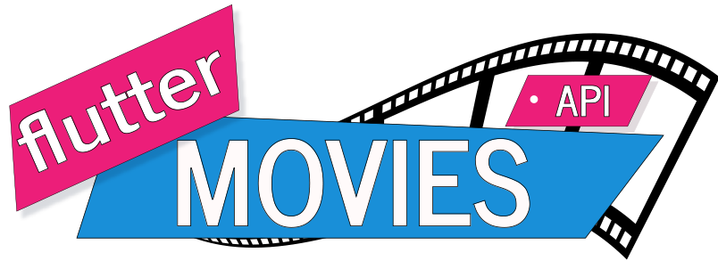
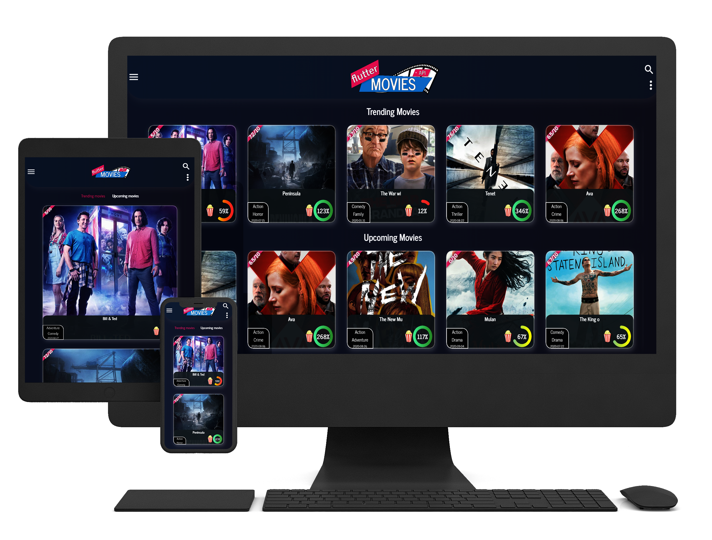

# Flutter Movies Application

 

## Overview

A movies application that connects to the  .
Get trending and newly released movies with in-depth details.
[Live Version](https://hypothermal-mixture.000webhostapp.com)

## Screenshots

On Load |Navigation| Search Product |
------------ |------------ | -------------|
 |  |

Toggle Drawer |Refresh| Toggle Search |
------------ |------------ | -------------|
 |  |

Search Error |Search No Results| Search Success |
------------ |------------ | -------------|
 |  |

To Movie Screen |From Movie Screen| Favorites |
------------ |------------ | -------------|
 |  |

Email |LinkedIn| Source |
------------ |------------ | -------------|
 |  |

## Features

- [x] When the app is loaded, trending movies and upcoming movies are loaded.
- [x] You can search for movies by typing in the search field and pressing enter.
**When on desktop there is a search button below TextField.**
**On Mobile or Tablet you can press the ok button on the virtual keyboard to start searching.**
- [x] When you tap on a movie , you get redirected to a new screen with detailed info.
- [x] On movie's screen there is a heart icon, by tapping it you favorite the movie. On successful addition, a snackbar is shown.
- [x] A favorited movie is indicated by a red heart. By tapping on the heart the movie will be removed from your favorites. On successful deletion, a snackbar is shown.
- [x] Favorited movies can be retrieved by opening the app's drawer.
- [ ] Favorited movies don't hold state since the project has no back-end, meaning on refresh all will be flushed. ***This is not an issue***.
- [x] The grid design is responsive.

**Mobile & Tablet**
 

 
**Laptop & Tablet**
 

- [x] There is a settings icon (three dots) where you can change theme (Dark, Light), send e-mail and visit the source code of the app.

## Libraries

| Name        | Version           | Use case |
| :------------- |:-------------:|:-------------:|
| [get](https://pub.dev/packages/get)| ^3.4.4 | ***Routing*** |
| [provider](https://pub.dev/packages/provider)     | ^4.3.2      | ***State Management***|
| [pedantic](https://pub.dev/packages/pedantic) | ^1.9.0     |***Static Analysis*** |
| [url_launcher](https://pub.dev/packages/url_launcher) | ^5.5.0   | ***Url Launcher***  |
| [dio](https://pub.dev/packages/dio) | ^3.0.10   | ***HTTP Requests***  |
| [google_fonts](https://pub.dev/packages/google_fonts) |  ^1.1.0   | ***Fonts***  |
| [responsive_builder](https://pub.dev/packages/responsive_builder) | ^0.2.0+2   | ***Responsiveness***  
| [logger](https://pub.dev/packages/logger) | ^0.9.2  | ***Logging***  |
| [flutter_dotenv](https://pub.dev/packages/flutter_dotenv) | ^2.1.0  | ***Environment Variables***  |
| [flutter_spinkit](https://pub.dev/packages/flutter_spinkit) | ^4.1.2+1  | ***Beautiful Spinkits***  |
| [modal_progress_hud](https://pub.dev/packages/modal_progress_hud) | ^0.1.3  | ***Loading HUD***  |
| [pull_to_refresh](https://pub.dev/packages/pull_to_refresh) | ^1.6.1  | ***Pull to Refresh***  |
| [flare_flutter](https://pub.dev/packages/flare_flutter) | ^2.0.6  | ***Flare Animations***  |
